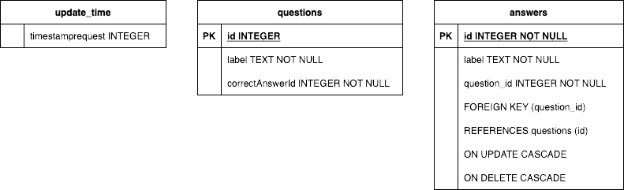

# Local  Database

::: warning Deprecated section
`SQL delight` is for now no more compatible with the new default **WASM** template for WebApp application.

If you still want to use it you can revert to the old **Js(IR)** template.

Notice that for now this is the **only** Web target compatible database library for KMP
:::

SQLDelight generates typesafe Kotlin APIs from your SQL statements. It verifies your schema, statements, and migrations at compile-time and provides IDE features like autocomplete and refactoring which make writing and maintaining SQL simple.

SQLDelight understands your existing SQL schema.

```sql
CREATE TABLE hockey_player (
  id INTEGER NOT NULL PRIMARY KEY AUTOINCREMENT,
  name TEXT NOT NULL,
  number INTEGER NOT NULL
);
```

It generates typesafe code for any labeled SQL statements.

::: warning 

Be carefull with SQL Delight , the project and his dependancies just move from `com.squareup.sqldelight.*`
to `app.cash.sqldelight.*`

Pay attention also with beta, alpha version of Android studio that could produce bugs on gradle task management for code generation of SQL Delight databases.
:::


## 🧪 Add sqldelight db to your quizz 

> Refer to the multiplatform implementation of SQLDelight in official Github pages
> 👉 [https://cashapp.github.io/sqldelight/2.0.0/multiplatform_sqlite/](https://cashapp.github.io/sqldelight/2.0.0/multiplatform_sqlite/)


#### Add the correct dependancies to the project
``` kotlin
plugins {
...
    id("app.cash.sqldelight") version "2.0.0"
}
...
 sourceSets {
        val commonMain by getting {
            dependencies {
              ...
                implementation("app.cash.sqldelight:runtime:2.0.0")
                implementation("app.cash.sqldelight:coroutines-extensions:2.0.0")
                implementation("org.jetbrains.kotlinx:kotlinx-datetime:0.4.1")

            }
        }
        val androidMain by getting {
            dependencies {
               ...
                implementation("app.cash.sqldelight:android-driver:2.0.0")

            }
        }
    ...
        val iosMain by creating {
         ...
            dependencies {
                ...
                implementation("app.cash.sqldelight:native-driver:2.0.0")
            }
        }
        val desktopMain by getting {
            dependencies {
               ...
                implementation("app.cash.sqldelight:sqlite-driver:2.0.0")
            }
        }
        ...
```
#### Create the native SQL driver factory and use it for creating the DB with `actual`/`expect` kotlin keywords

#### Read carefully the modelisation UML below 



#### Create you SQLDelight model 'QuizDatabase.sq'

#### Create your Database datasource by generating insert and update suspending functions

#### Update your repository by instanciating your database

Your repository handle the following cases :
* If there is no network and it's the first time launch of the app : handle and error 
* if there is no network and you have db datas : return on the flow the db data
* if there is network and db data are younger than 5 min : return on the flow the db data
* if there is network and db data are older than 5 min : retourn on the flow the network data and reset db data


## 🎯 Solutions

::: details QuizDatabase.sq (ressources of commonMain)*

```sql
CREATE TABLE update_time (
     timestamprequest INTEGER
);

INSERT INTO update_time(timestamprequest) VALUES (0);

CREATE TABLE questions (
    id INTEGER PRIMARY KEY,
    label TEXT NOT NULL,
    correctAnswerId INTEGER  NOT NULL
 );


 CREATE TABLE answers (
    id INTEGER NOT NULL,
    label TEXT NOT NULL,
    question_id INTEGER NOT NULL,
    PRIMARY KEY (id, question_id),
    FOREIGN KEY (question_id)
      REFERENCES questions (id)
          ON UPDATE CASCADE
          ON DELETE CASCADE
 );


 selectUpdateTimestamp:
 SELECT *
 FROM update_time;

 insertTimeStamp:
 INSERT INTO update_time(timestamprequest)
 VALUES (:timestamp);

 deleteTimeStamp:
 DELETE FROM update_time;

 deleteQuestions:
 DELETE FROM questions;

 deleteAnswers:
 DELETE FROM answers;


 selectAllQuestionsWithAnswers:
 SELECT *
 FROM questions
 INNER JOIN answers ON questions.id = answers.question_id;

 insertQuestion:
 INSERT INTO questions(id, label,correctAnswerId)
 VALUES (?, ?, ?);

 insertAnswer:
 INSERT INTO answers(id, label,question_id)
 VALUES (?, ?, ?);

```
:::

::: details network/QuizDB.kt (commonMain)
``` kotlin
package network


import app.cash.sqldelight.async.coroutines.awaitAsList
import app.cash.sqldelight.async.coroutines.awaitAsOneOrNull
import app.cash.sqldelight.db.SqlDriver
import com.myapplication.common.cache.Database
import kotlinx.coroutines.CoroutineScope
import network.data.Answer
import network.data.Question

class QuizDbDataSource(private val sqlDriver: SqlDriver, private val coroutineScope: CoroutineScope) {

    private  var database=Database(sqlDriver)
    private  var quizQueries=database.quizDatabaseQueries


    suspend fun getUpdateTimeStamp():Long = quizQueries.selectUpdateTimestamp().awaitAsOneOrNull()?.timestamprequest ?: 0L


    suspend fun setUpdateTimeStamp(timeStamp:Long)  {
        quizQueries.deleteTimeStamp()
        quizQueries.insertTimeStamp(timeStamp)
    }

     suspend fun getAllQuestions(): List<Question> {
         return quizQueries.selectAllQuestionsWithAnswers().awaitAsList()

             .groupBy {it.question_id }
             .map { (questionId, rowList) ->

             Question(
                 id = questionId,
                 label = rowList.first().label,
                 correctAnswerId = rowList.first().correctAnswerId,
                 answers = rowList.map { answer ->
                     Answer(
                         id = answer.id_,
                         label = answer.label_
                     )
                 }
             )
         }
     }


    suspend fun insertQuestions(questions:List<Question>) {
        quizQueries.deleteQuestions();
        quizQueries.deleteAnswers()
        questions.forEach {question ->
            quizQueries.insertQuestion(question.id, question.label, question.correctAnswerId)
            question.answers.forEach {answer ->
                quizQueries.insertAnswer(answer.id,answer.label,question.id)
            }
        }
    }
}
```
:::

::: details QuizRepository.kt
```kotlin
package network

import app.cash.sqldelight.db.SqlDriver
import kotlinx.coroutines.CoroutineScope
import kotlinx.coroutines.Dispatchers
import kotlinx.coroutines.flow.MutableStateFlow
import kotlinx.coroutines.flow.update
import kotlinx.coroutines.launch
import kotlinx.datetime.Clock
import network.data.Question


class QuizRepository(sqlDriver: SqlDriver)  {

    private val mockDataSource = MockDataSource()
    private val quizAPI = QuizApiDatasource()
    private val coroutineScope = CoroutineScope(Dispatchers.Main)
    private var quizDB = QuizDbDataSource(sqlDriver,coroutineScope)

    private var _questionState=  MutableStateFlow(listOf<Question>())
    val questionState get() = _questionState

    init {
        updateQuiz()
    }

    private suspend fun fetchQuiz(): List<Question> = quizAPI.getAllQuestions().questions

    private suspend fun fetchAndStoreQuiz(): List<Question>{
        val questions  = fetchQuiz()
        quizDB.insertQuestions(questions)
        quizDB.setUpdateTimeStamp(Clock.System.now().epochSeconds)
        return questions
    }
    private fun updateQuiz(){


        coroutineScope.launch {
            _questionState.update {
                try {
                    val lastRequest = quizDB.getUpdateTimeStamp()
                    if(lastRequest == 0L || lastRequest - Clock.System.now().epochSeconds > 300000){
                        fetchAndStoreQuiz()
                    }else{
                        quizDB.getAllQuestions()
                    }
                } catch (e: NullPointerException) {
                    fetchAndStoreQuiz()
                } catch (e: Exception) {
                    e.printStackTrace()
                    mockDataSource.generateDummyQuestionsList()
                }

            }
        }
    }
}
```
:::


::: tip More databases options
For not using SQLight ORM, you can use [`Realm kotlin`](https://github.com/realm/realm-kotlin) or [KStore](https://github.com/xxfast/KStore)
:::

**✅ If everything is fine, go to the next chapter →**

## 📖 Further reading 
- [SQL Delight tutorial (obsolete)](https://www.jetbrains.com/help/kotlin-multiplatform-dev/multiplatform-ktor-sqldelight.html)
- [SQL Delight lib ](https://github.com/cashapp/sqldelight)


