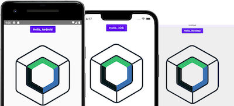

# Configure a KMP project (10 min)

## 🧪 Plugins installation

* Open Android Studio Giraffe or above
* Select ``Plugins`` tab  
* search for [``Kotlin Multiplatform``](https://plugins.jetbrains.com/plugin/14936-kotlin-multiplatform-mobile) and click on install button
* search for [``Compose Multiplatform``](https://plugins.jetbrains.com/plugin/16541-compose-multiplatform-ide-support) and click on install button  

* restart your IDE

::: tip
For macOS devs only,[``kdoctor``](https://github.com/Kotlin/kdoctor) command line interface (CLI) is available.
It will help you to ensure that your computer is correctly configured for KMP development.

```bash
brew install kdoctor
kdoctor
```
:::

## 🧪 Fork the KMP template provided by JetBrains

[](https://github.com/JetBrains/compose-multiplatform-template)

Because kotlin mutiplatform is evolving a lot, the best template compatible for Android, iOS and Desktop is available on a dedicated github project [here](https://github.com/JetBrains/compose-multiplatform-template)

* Fork the project 
* Open it with Android Studio


## 📚  A Guided tour of the sample project

::: tip
If you already understand KMP project structure, you can skip this session
:::

#### Project Structure

There are two views for KMP projects in Android studio :
* **Android view (default)** : a logical view grouping and sorting android releated files. It's a very convenient view when you are dealing with android/kotlin code. This view also groups the gradle configurations files making easier to use this view for global project configuration. But from there no iOS swift code (the module simply not shows up), android modules (androidMain, androidApp) folders are hidden but content is listed.
* **Project view** : a filesystem view of your project. From there you can open you iOS swift source code and have the full control of your files, directories

You can switch between them on the project tab in the IDE


#### 1 - The crossplatform library module (shared)

A shared library module linked to all project platforms (```commonMain```). Contains the source code common to all your supported platforms.

##### 1.1 - Shared kotlin source files (commonMain)

This is the place where you will code all your cross platform composables.

On the sample, your first composable function ```App() ``` is already configured  with a single button that display an image with a standard animation on click.

::: details App.kt
```kotlin
@OptIn(ExperimentalResourceApi::class)
@Composable
fun App() {
    MaterialTheme {
        var greetingText by remember { mutableStateOf("Hello, World!") }
        var showImage by remember { mutableStateOf(false) }
        Column(Modifier.fillMaxWidth(), horizontalAlignment = Alignment.CenterHorizontally) {
            Button(onClick = {
                greetingText = "Hello, ${getPlatformName()}"
                showImage = !showImage
            }) {
                Text(greetingText)
            }
            AnimatedVisibility(showImage) {
                Image(
                    painterResource("compose-multiplatform.xml"),
                    contentDescription = "Compose Multiplatform icon"
                )
            }
        }
    }
```
:::


#### 2 -  KMP specific library modules (iosMain, androidMain)

One submodule per platform, linked to the common module sources. It gives the possibility to make specific implementations of functions per platform 

##### 2.1 - Platform specific source file

When you need a specific implementation for Android and iOS of getPlatform() to return the platform name, KMP uses :

* ```expect``` keyword on the KMP shared library (commonMain) before functions indicating that we need a specific implementation of this function
* ```actual``` keywords on the KMP shared library specific modules (iosMain, androidMain) before functions to indicate the implementation.

::: tip
More information about platform specific functions in KMP [here](https://kotlinlang.org/docs/multiplatform-connect-to-apis.html))
::: 

For exemple on this specific template, a ```getPlatformName``` fuction is referenced on the common code and implemented specificly on each sourceset with the right platform name

::: details app.kt (SourceSet : commonMain)
```kotlin
expect fun getPlatform(): Platform
```
:::

::: details main.desktop.kt (SourceSet : desktopMain)
```kotlin
actual fun getPlatformName(): String = "Desktop"
```
:::

::: details main.android.kt (SourceSet : androidMain)
```kotlin
actual fun getPlatformName(): String = "Android"
```
:::

::: details main.ios.kt(SourceSet : iosMain)
```kotlin
actual fun getPlatformName(): String = "iOS"
```
:::

#### 3 - Apps modules 

The modules that will use the developped common library. Here you can configure Android/iOS final apps.
If your are not using compose multiplatform, you can develop your views here.

On this template a wrapper is used to use the root ```App()``` composable on each specific modules
Then the ```App()``` composable is used on each platform library code

#### In Desktop app module (DesktopApp)

::: details main.desktop.kt(SourceSet : desktopMain)
```kotlin
@Composable fun MainView() = App()

@Preview
@Composable
fun AppPreview() {
    App()
}
```
::: 
#### In Android app module  (AndroidApp)

The Android app declaration with ressouces, manifest and activities
A ```MainView``` android composable is created from the App() composable.

::: details main.android.kt (SourceSet : androidMain)
```kotlin
@Composable fun MainView() = App()
```
:::

Then the composable is declared on the activity.

::: details MainActivity.kt (androidApp)
```kotlin
class MainActivity : AppCompatActivity() {
    override fun onCreate(savedInstanceState: Bundle?) {
        super.onCreate(savedInstanceState)

        setContent {
            MainView()
        }
    }
}
```
::: 
####  In iOS app module  (IosApp)

For ```iOSApp``` project you can open the .xcworkspace with Xcode for completion, build specific configurations

It's the same principles, a swift mainviewcontroller is created from the composable ```App()```

::: details main.ios.kt(SourceSet : iosMain)
```kotlin
fun MainViewController() = ComposeUIViewController { App() }
```
:::

Then on your ContentView.swift code the template  call for ```MainViewController()``` as entry of the app

::: details ContentView.swift (iosApp)
```kotlin
...
 func makeUIViewController(context: Context) -> UIViewController {
        Main_iosKt.MainViewController()
    }
...
```
:::

With those configuration you can now develop you composable only in the ```commonMain``` SourceSet and deploy your app in Android, iOS and Destop targets

## 🧪 Deploy your apps 

To defines gradle configuration for deploying your development apps, you need to create a running configuration
describing gradle tasks


*deployment topbar*

#### Running configuration for Android, iOS 

Nothing to do, your running configuration is already set  
You can select the config and click on play button to start the app on the device

#### Running configuration for Desktop 

For the desktop app you need to create a new configuration ( ``Edit Configurations...`` button)

* Then you can click on the top left ``+``button of the opened window 
* select ``gradle`` on the list
* on ``Run`` input field, set 
```bash
desktopApp:run
```
* click on ``ok``
* Try to build your application.



**✅ If everything is fine, go to the next chapter →**

::: tip
Before going to the next step, you that can get the project configured at this step [here](https://github.com/worldline/learning-kotlin-multiplatform/raw/main/docs/src/assets/sources/km-part0-initial.zip)
:::


## 📖 Further reading 
- [Android studio/Gradle compatibility guide](https://developer.android.com/studio/releases#android_gradle_plugin_and_android_studio_compatibility)
- [Multiplatform/Kotlin compatibility guide](https://github.com/JetBrains/compose-multiplatform/blob/master/VERSIONING.md#kotlin-compatibility)
- [iOS project structure](https://kotlinlang.org/docs/multiplatform-mobile-understand-project-structure.html#ios-application)
- [Cocoapods dependancy manager](https://kotlinlang.org/docs/native-cocoapods.html#use-a-kotlin-gradle-project-as-a-cocoapods-dependency)

