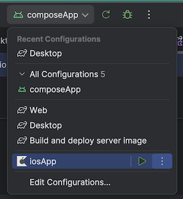

# Configure KMP

[Android studio IDE](https://developer.android.com/studio) is the dedicated IDE to consider for KMP developpement

Simply download it thanks to [Jetbrain ToolBox App](https://www.jetbrains.com/toolbox-app/)


And install the latest stable version of [Android Studio IDE](https://developer.android.com/studio). You can do the following to prepare it to support KMP


## For macOS : 
The latest plugin kotlin multiplatform is available [here](https://plugins.jetbrains.com/plugin/14936-kotlin-multiplatform). It enables templates for kickstarting KMP projects, helps for global project configuration, compose previews, and more.

  

* Open Android Studio
* Select ``Plugins`` tab
* search for [``Kotlin Multiplatform``](https://plugins.jetbrains.com/plugin/14936-kotlin-multiplatform-mobile) and click on install button
* restart your IDE

## For Windows/Linux :
There is still a support for Compose Multiplatform plugin for Android Studio, the support will be removed once KMP plugin will be available for all platforms. You can install it [here](https://plugins.jetbrains.com/plugin/16541-compose-multiplatform-for-desktop-ide-support)


* search for [``Compose Multiplatform``](https://plugins.jetbrains.com/plugin/16541-compose-multiplatform-for-desktop-ide-support) and click on install button
* restart your IDE


::: tip configuration helper

For macOS devs only,[``kdoctor``](https://github.com/Kotlin/kdoctor) command line interface (CLI) is available.
It will help you to ensure that your computer is correctly configured for KMP development.

```bash
brew install kdoctor
kdoctor
```

:::

## 🧪 Download the initial project


For your hand-on lab today, you can download the initial project by downloading KMP official sample for Android, iOS and Desktop & Web here:  [kmp.jetbrains.com](https://kmp.jetbrains.com/)

* Select :  ☑️ Android ☑️ iOS ☑️ Desktop ☑️ Web
* `Download` the zip project
* Open it with `Android studio`


## 📚  A Guided tour of the sample project

#### Project Structure

The gradle plugin of Kotlin Multiplatform ( KMP ) organize the code thanks to 2 essential notion of Gradle/Java :

* A `Module` is a set of classes and packages that form a complete whole with a build description file `build.gradle`. Modules have been introduced to improve safety and to make the platform more modular.
* A `Source sets` give us a powerful way to structure source code in our Gradle projects. A SourceSet represents a logical group of Kotlin source and resource files.


#### 1  - `composeApp` module : The crossplatform library module

A shared library module linked to all project platforms. It contains the source code common to all your supported platforms.

##### 2 - `commonMain` sourceSet : Shared & multiplatform Kotlin source files

This is the place where you will code all your cross platform composables.

On the sample, your first composable function ``App() `` is already configured  with a single button that display an image with a standard animation on click.

::: details App.kt

```kotlin
@Composable
@Preview
fun App() {
    MaterialTheme {
        var showContent by remember { mutableStateOf(false) }
        Column(Modifier.fillMaxWidth(), horizontalAlignment = Alignment.CenterHorizontally) {
            Button(onClick = { showContent = !showContent }) {
                Text("Click me!")
            }
            AnimatedVisibility(showContent) {
                val greeting = remember { Greeting().greet() }
                Column(Modifier.fillMaxWidth(), horizontalAlignment = Alignment.CenterHorizontally) {
                    Image(painterResource(Res.drawable.compose_multiplatform), null)
                    Text("Compose: $greeting")
                }
            }
        }
    }
}
```

:::

#### 3 - `androidMain`, `desktopMain`, `iosMain`, `wasmJsMain` sourceSets: KMP specific library modules

One submodule per platform, linked to the common module sources. It gives the possibility to make specific implementations of functions per platform

##### Platform specific source file

When you need a specific implementation for Android and iOS of getPlatform() to return the platform name, KMP uses :

* ``expect`` keyword on the KMP shared library (commonMain) before functions indicating that we need a specific implementation of this function
* ``actual`` keywords on the KMP shared library specific modules (iosMain, androidMain) before functions to indicate the implementation.

For exemple on this specific template, a ``getPlatformName`` fuction is referenced on the common code and implemented specificly on each sourceset with the right platform name

::: details platform.kt (SourceSet : commonMain)

```kotlin
expect fun getPlatform(): Platform
```

:::

::: details Platform.desktop.kt (SourceSet : desktopMain)

```kotlin
actual fun getPlatformName(): String = "Desktop"
```

:::

::: details Platform.android.kt (SourceSet : androidMain)

```kotlin
actual fun getPlatformName(): String = "Android"
```

:::

::: details Platform.ios.kt(SourceSet : iosMain)

```kotlin
actual fun getPlatformName(): String = "iOS"
```

:::

::: tip More Information

On each platform sourceSet (`androidMain`, `desktopMain`, `iosMain`, `wasmJsMain`) , you can call native SDK function wrapped in Kotlin.

Ex: on Platform.ios.kt a UIDevice function is called :

```kotlin
UIDevice.currentDevice.systemName()
```

More information about platform specific functions in KMP [here](https://kotlinlang.org/docs/multiplatform-connect-to-apis.html))
:::

##### Platform specific composables

On this template a wrapper is used to use the root multiplatform composable  ``App()``  on each specific sourceSet `Main`class  :

* `onCreate` callback of an `Activity` for Android
* A `ViewController` class for iOS
* ...
  Then you can code and declare your composables on the  ``App()`` composable to code multiplatform.

#### For Desktop  (DesktopMain)

::: details main.desktop.kt(SourceSet : desktopMain)

```kotlin
fun main() = application {
    Window(
        onCloseRequest = ::exitApplication,
        title = "Quiz",
    ) {
        App()
    }
}
```

:::

#### For Android   (AndroidMain)

The Android app declaration with ressouces, manifest and activities
A ``MainView`` android composable is created from the App() composable.

::: details main.android.kt (SourceSet : androidMain)

```kotlin
@Composable fun MainView() = App()
```

:::

Then the composable is declared on the activity.

::: details MainActivity.kt (androidApp)

```kotlin
class MainActivity : ComponentActivity() {
    override fun onCreate(savedInstanceState: Bundle?) {
        super.onCreate(savedInstanceState)

        setContent {
            App()
        }
    }
}
```

:::

#### 4. for iOS  (IosMain)

For ``iOSApp`` project you can open the .xcodeproj with Xcode for completion, build specific configurations

It's the same principles, a swift `MainViewController` that is created from the composable ``App()``

::: details main.ios.kt(SourceSet : iosMain)

```kotlin
fun MainViewController() = ComposeUIViewController { App() }
```

:::

Then on the .xcodeproj, `ContentView.swift` convert the `MainViewController` into a swiftUI view.

::: details ContentView.swift (iosApp)

```kotlin
...
struct ComposeView: UIViewControllerRepresentable {
    func makeUIViewController(context: Context) -> UIViewController {
        MainViewControllerKt.MainViewController()
    }

    func updateUIViewController(_ uiViewController: UIViewController, context: Context) {}
}

struct ContentView: View {
    var body: some View {
        ComposeView()
                .ignoresSafeArea(.keyboard) // Compose has own keyboard handler
    }
}
...
```

:::

With those configuration you can now develop your composable  in the ``commonMain`` SourceSet and deploy your app for Android, iOS and Destop targets

## 🧪 Deploy your apps

You can declare in android studio `gradle` run configurations

```bash
./gradlew composeApp:desktopRun -DmainClass=com.worldline.quiz.MainKt
./gradlew wasmJsBrowserDevelopmentRun #Web
```

#### Running configuration




## Version Catalog

A `version catalog` is a list of dependencies, represented as dependency coordinates, that a user can pick from when declaring dependencies in a build script.

::: details gradle/libs.versions.toml

```toml

[versions]
# KMP AGP/GRADLE compatibility guide
# https://wrl.li/guideagp
kotlin = "2.0.20"
agp = "8.5.0"
compose-plugin = "1.7.0-rc01"

androidx-activityCompose = "1.9.2"
navigation = "2.8.0-alpha10"
androidx-lifecycle = "2.8.0"
kotlinxCoroutinesCore="1.9.0"

kotlinx-coroutines = "1.8.1"
kotlinxDatetime = "0.6.1"
ktorVersion = "3.0.0-rc-1"
kstore = "0.8.0"
logback = "1.5.8"

android-compileSdk = "34"
android-minSdk = "24"
android-targetSdk = "34"

[libraries]
androidx-activity-compose = { module = "androidx.activity:activity-compose", version.ref = "androidx-activityCompose" }

androidx-lifecycle-viewmodel = { group = "org.jetbrains.androidx.lifecycle", name = "lifecycle-viewmodel", version.ref = "androidx-lifecycle" }
androidx-lifecycle-runtime-compose = { group = "org.jetbrains.androidx.lifecycle", name = "lifecycle-runtime-compose", version.ref = "androidx-lifecycle" }

kotlinx-coroutines-swing = { group = "org.jetbrains.kotlinx", name = "kotlinx-coroutines-swing", version.ref = "kotlinx-coroutines" }
kotlinx-coroutines-core = { module = "org.jetbrains.kotlinx:kotlinx-coroutines-core", version.ref = "kotlinxCoroutinesCore" }


kotlin-navigation = { module = "org.jetbrains.androidx.navigation:navigation-compose", version.ref = "navigation" }
kotlinx-datetime = { module = "org.jetbrains.kotlinx:kotlinx-datetime", version.ref = "kotlinxDatetime" }

ktor-serialization-kotlinx-json = { module = "io.ktor:ktor-serialization-kotlinx-json", version.ref = "ktorVersion" }
ktor-client-core = { module = "io.ktor:ktor-client-core", version.ref = "ktorVersion" }
ktor-client-content-negotiation = { module = "io.ktor:ktor-client-content-negotiation", version.ref = "ktorVersion" }
ktor-client-okhttp = { module = "io.ktor:ktor-client-okhttp", version.ref = "ktorVersion" }
ktor-client-apache = { module = "io.ktor:ktor-client-apache", version.ref = "ktorVersion" }
ktor-client-darwin = { module = "io.ktor:ktor-client-darwin", version.ref = "ktorVersion" }


#kstore
kstore = { module = "io.github.xxfast:kstore", version.ref = "kstore" }
kstore-file = { module = "io.github.xxfast:kstore-file", version.ref = "kstore" }
kstore-storage = { module = "io.github.xxfast:kstore-storage", version.ref = "kstore" }

# Web
#ktor-client-js = { module = "io.ktor:ktor-client-js", version.ref = "ktorVersion" }

# Server
ktor-server-core = { module = "io.ktor:ktor-server-core-jvm", version.ref = "ktorVersion" }
ktor-server-cio = { module = "io.ktor:ktor-server-cio", version.ref = "ktorVersion" }
ktor-server-content-negotiation = { module = "io.ktor:ktor-server-content-negotiation", version.ref = "ktorVersion" }
ktor-server-config-yaml = { module = "io.ktor:ktor-server-config-yaml", version.ref = "ktorVersion" }
ktor-server-cors = { module = "io.ktor:ktor-server-cors", version.ref = "ktorVersion" }
logback = { module = "ch.qos.logback:logback-classic", version.ref = "logback" }

[plugins]
androidApplication = { id = "com.android.application", version.ref = "agp" }
androidLibrary = { id = "com.android.library", version.ref = "agp" }
composeMultiplatform = { id = "org.jetbrains.compose", version.ref = "compose-plugin" }
composeCompiler = { id = "org.jetbrains.kotlin.plugin.compose", version.ref = "kotlin" }
kotlinMultiplatform = { id = "org.jetbrains.kotlin.multiplatform", version.ref = "kotlin" }
kotlinSerialization = { id = "org.jetbrains.kotlin.plugin.serialization", version.ref = "kotlin" }
kotlinJvm = { id = "org.jetbrains.kotlin.jvm", version.ref = "kotlin" }
ktor = { id = "io.ktor.plugin", version.ref = "ktorVersion" }

```

:::

## Basic logging

A logger is provided by [`Ktor client library`](https://ktor.io/docs/logging.html) for basic logs.

::: tip More advanced logging and debugging

Use can have more advanced logging and debugging thanks to third party libs such as [`NSExceptionKT`](https://github.com/rickclephas/NSExceptionKt) or [`CrachKiOS`](https://github.com/touchlab/CrashKiOS) or [`Kermit`](https://github.com/touchlab/Kermit) or [`Napier`](https://github.com/AAkira/Napier)

:::

**✅ If everything is fine, go to the next chapter →**

## 📖 Further reading

- [Android studio/Gradle compatibility guide](https://developer.android.com/studio/releases#android_gradle_plugin_and_android_studio_compatibility)
- [Multiplatform/Kotlin compatibility guide](https://github.com/JetBrains/compose-multiplatform/blob/master/VERSIONING.md#kotlin-compatibility)
- [iOS project structure](https://kotlinlang.org/docs/multiplatform-mobile-understand-project-structure.html#ios-application)
- [Cocoapods dependancy manager](https://kotlinlang.org/docs/native-cocoapods.html#use-a-kotlin-gradle-project-as-a-cocoapods-dependency)
