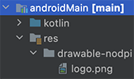
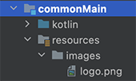

# Let's go further (5min)

## Create Navigation between composable screens 

[`PreCompose`](https://github.com/Tlaster/PreCompose/blob/master/docs/component/navigation.md) is a third party library that enables missing features
of the KMP beta. 

It can enables feature similar to Android Jetpack compose such as : 
* Navigation with navigation host
* ViewModel from Android Architecture pattern
* Molecule that improve business logic development thanks to flows

For this codelab we will mainly focus on navigation feature of PreCompose.

### Add `PreCompose` dependency to your project

*gradle.build.kts (shared)*
```groovy
...
val commonMain by getting {
            dependencies {
                ...
                api("moe.tlaster:precompose:1.3.15")
...

```

### Replace `AndroidApp`, `desktopApp` root view by precompose view

*MaintActivity.kt (`AndroidApp`)*

```kotlin
...
import moe.tlaster.precompose.lifecycle.PreComposeActivity
import moe.tlaster.precompose.lifecycle.setContent

class MainActivity : PreComposeActivity() {
    override fun onCreate(savedInstanceState: Bundle?) {
        super.onCreate(savedInstanceState)
        setContent {
            AndroidApp()
...
```

*Maint.kt (`desktopApp`)*
```kotlin
...
import moe.tlaster.precompose.PreComposeWindow

fun main() = application { // kotlin application
        PreComposeWindow(onCloseRequest = ::exitApplication, title = "QuizzApp") {
                DesktopApp() 
...
```

### Create your navigation host 

The navigation host is the configuration class that defines routes 
of your application. 

Routes are path between all the composable screens that you will call later on your app.


For this codelab we need 3 routes for : 
* At startup to the `WelcomeScreen`
* from Welcome screen to the `QuizScreen`
* from the final question `QuizScreen`to the `ScoreScreen` 

*Navhost.kt* (commonMain)
```kotlin
private val quizRepository = QuizRepository()

@Composable
internal fun rootNavHost() {

    val navigator = rememberNavigator()
    NavHost(
        navigator = navigator,
        navTransition = NavTransition(),
        initialRoute = "/welcome",
    ) {
        scene(
            route = "/welcome",
            navTransition = NavTransition(),
        ) {
            welcomeScreen(navigator)
        }
        scene(
            route = "/quiz",
            navTransition = NavTransition(),
        ) {

            val questions = quizRepository.questionState.collectAsState()

            if (questions.value.isNotEmpty()) {
                questionScreen(navigator, questions.value)
            }
        }
        scene(
            route = "/score/{score}",
            navTransition = NavTransition(),
        ) { backStackEntry ->
            backStackEntry.path<String>("score")?.let { score ->
                scoreScreen(navigator, score)
            }
        }
    }
}
```

::: warning

As you can see all composables now take as parameter a navigator.
It will be needed to navigate with routes between screens.

for example, the `WelcomeScreen` composable is now declared as follows :

```kotlin
@Composable()
internal fun welcomeScreen(navigator: Navigator){
    ...

```
:::

### Use the navigation host

#### instantiate the navHost on the App main composable.
Because the `WelcomeScreen` was set as initialRoute, it will start correctly the quizz

*App.kt (commonMain)*

```kotlin
@Composable
internal fun App() {
    MaterialTheme {
        rootNavHost()
    }
}
```

#### User the `navigator`on screen buttons click

*WelcomeScreen.kt* (commonMain)
```kotlin
...
Button(
    modifier = Modifier.padding(all = 10.dp),
    onClick = { navigator.navigate(route = "/quiz") }
) {
    Text("Start the Quizz")
}
...
```

*QuestionScreen.kt* (commonMain)
```kotlin
...
Button(
    modifier = Modifier.padding(bottom = 20.dp),
    onClick = {
        if(selectedAnswer == questions[questionProgress].correctAnswerId) {
            score++ // Increment the score when answer is correct
        }
        if (questionProgress < questions.size - 1) {
            questionProgress++ // Case 1 : Still some questions
            selectedAnswer = 1 // -> recompose QuizQuestion
        }else{
            // Case 2 : no more questions
            // -> navigate to score screen
            navigator.navigate("/score/$score out of ${questions.size}")
        }
}
...
```

*ScoreScreen.kt* (commonMain)
```kotlin
...
Button(
    modifier = Modifier.padding(all = 20.dp),
    onClick = {
        navigator.navigate(route = "/quiz")
    }
) {
    Icon(Icons.Filled.Refresh, contentDescription = "Localized description")
    Text(text = "Retake the Quizz",)
}
...
```

::: warning

Depending of your JDK used, compiler can complain about mismatch of jvm version for android and desktop.
In that case, update your `jvmtarget` defined in `build.gradle.kts` (shared) 

:::

## Manage image ressources and texts

For now on KMP , there is no ideal solutions for managing images and texts for all platforms.

The current solution is to use KMP possibilities for custom compose function implementation.

Each platform will have his own implementation of `getMyImage` function that will do the specific
code to retrieve the image.

### Add the image correctly on the project

#### On the androidMain ressources



#### On the commonMain ressources



### Declare the KMP function

*Platform.kt (commonMain)*
```kotlin
...
        return "Hello, ${platform.name}!"
    }
}

@Composable
internal expect fun getMyImage( imageName:String): Painter
```


### Android 

*Platform.kt (androidMain)*
```kotlin
@Composable
internal actual fun getMyImage( imageName:String): Painter {
    val c = R.drawable::class.java
    val field: Field = c.getField(imageName)
    val id: Int = field.getInt(null)
    return painterResource(id)

}
```


### Desktop 

*Platform.kt (desktopMain)*
```kotlin
@Composable
internal actual fun getMyImage(imageName: String ) = painterResource("images/$imageName.png")
```

### iOS

::: warning
For now no iOS support is available.
We simply provide a dummy function implementation.
:::

*Platform.kt (iosMain)*
```kotlin
@Composable
internal actual fun getMyImage( imageName:String): Painter {
    TODO("Not yet implemented")
}
```

### Usage on the app

*WelcomeScreen.kt and ScoreScreen.kt*

```kotlin
if(getPlatform().name != "iOS")
...
    Image(
        painter = getMyImage("logo"),
        contentDescription = "Logo of the quiz app", // decorative
        contentScale = ContentScale.Fit,
        modifier = Modifier.width(150.dp).padding(20.dp)
        )
...
```

The same principles apply on text ressources. 

## Ressources
- [Precompose navigation](https://github.com/Tlaster/PreCompose/blob/master/docs/component/navigation.md)
