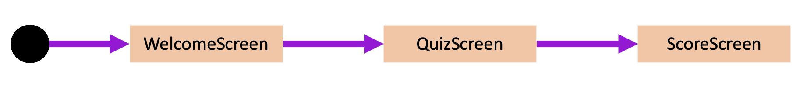

# Navigation & more

##  🧪 Create Navigation between composable screens 

Compose multiplatform navigation library enable a navigation with `navigation host`


#### Add `Navigation` dependency to your project

::: details gradle.build.kts (module : composeApp)
```kotlin
...
 commonMain.dependencies {
            ...
            implementation(libs.kotlin.navigation)
...
```
::: 

#### Create your navigation host 

The navigation host is the configuration class that defines routes 
of your application. 

Routes are path between all the composable screens that you will call later on your app.




For this Hands-on Lab we need 3 routes for : 
* At startup to the `WelcomeScreen`
* from Welcome screen to the `QuizScreen`
* from the final question `QuizScreen`to the `ScoreScreen` 

::: details App.kt (SourceSet: commonMain)
```kotlin
@Composable
fun App(
    viewModel: QuizViewModel = viewModel { QuizViewModel() },
    navController: NavHostController = rememberNavController()
) {

    MaterialTheme {
        NavHost(
            navController = navController,
            startDestination = "/welcome",
        ) {
            composable(route = "/welcome") {
                welcomeScreen(
                    onStartButtonPushed = {
                        navController.navigate(route = "/quiz")
                    }
                )
            }
            composable(route = "/quiz") {

                val questions by viewModel.questionState.collectAsState()

                if (questions.isNotEmpty()) {
                    questionScreen(
                        questions = questions,
                        onFinishButtonPushed = { score: Int, questionSize: Int ->

                            /* FOR SPEAKER TALK DEMO ON WEB APP */ if (getPlatform().name == "WASM") viewModel.postStats(
                            score,
                            "user-${(0..1000).random()}"
                        )
                            navController.navigate(route = "/score/$score/$questionSize")
                        },
                        /* FOR SPEAKER TALK DEMO ON WEB APP */
                        onSaveStatQuestion = { id: Long, question: String, answerId: Long, correctAnswerId: Long, answer: String ->
                            viewModel.addStats(id, question, answerId, correctAnswerId, answer)
                        }
                    )
                }
            }
            composable(route = "/score/{score}/{total}") {
                scoreScreen(
                    score = it.arguments?.getString("score").toString(),
                    total = it.arguments?.getString("total").toString(),
                    onResetButtonPushed = {
                        navController.navigate(route = "/quiz")
                    }
                )
            }

        }
    }
}
```
::: 

::: warning

As you can see all composables now take as parameter a navigator.
It will be needed to navigate with routes between screens.

for example, the `WelcomeScreen` composable is now declared as follows :

```kotlin
@Composable()
internal fun welcomeScreen(navigator: Navigator){
    ...

```
:::

#### Use the navigation host

##### Use the callback

Use `onStartButtonPushed` declared on screen instantiation in the `NavHost` on welcome screen buttons click

::: details WelcomeScreen.kt (SourceSet: commonMain)
```kotlin
...
    Button(
        modifier = Modifier.padding(all = 10.dp),
        onClick = { onStartButtonPushed() }
    ) {
...
```

The same can be done for other screens

*QuestionScreen.kt* (commonMain)
```kotlin
...
Button(
                modifier = Modifier.padding(bottom = 20.dp),
                onClick = {
                    /* FOR SPEAKER TALK DEMO ON WEB APP */
                    if (getPlatform().name == "WASM") {
                        onSaveStatQuestion(
                            questions[questionProgress].id,
                            questions[questionProgress].label,
                            selectedAnswer,
                            questions[questionProgress].correctAnswerId,
                            questions[questionProgress].answers[selectedAnswer.toInt() - 1].label
                        )
                    }

                    if (selectedAnswer == questions[questionProgress].correctAnswerId) {
                        score++
                    }
                    if (questionProgress < questions.size - 1) {
                        questionProgress++
                        selectedAnswer = 1
                    } else {
                        onFinishButtonPushed(score, questions.size)
                    }
                }
}
...
```
:::

::: details ScoreScreen.kt (SourceSet : commonMain)
```kotlin
...
 Button(
     modifier = Modifier.padding(all = 20.dp),
    onClick = {
        onResetButtonPushed()
     }
 ) 
...
```
:::


## 🎯 Solutions

::: tip
The full sources can be retrieved [here](#) 
:::

## 👷‍♂️ Manage  ressources

- For common code, store your resource files in the resources directory of the commonMain source set.
- For platform-specific code, store your resource files in the resources directory of the corresponding source set.

 Jetbrain release his experimental API `painterResource` from `org.jetbrains.compose.resource` package
```kotlin
@ExperimentalResourceApi
@Composable
public fun painterResource(
    res: String
): Painter
```

- **Return** a Painter from the given resource path. Can load either a BitmapPainter for rasterized images (.png, .jpg) or a VectorPainter for XML Vector Drawables (.xml).
- **XML Vector Drawables** have the same format as for Android (https://developer.android.com/reference/android/graphics/drawable/VectorDrawable) except that external references to Android resources are not supported. 
- Note that XML Vector Drawables are not supported for Web target currently.
  
### Android
To make your resources accessible from the resource library, use the following configuration in your build.gradle.kts file:

```kotlin
android {
    // …
    sourceSets["main"].resources.srcDirs("src/commonMain/resources")
}
```

For iOS, the Compose Multiplatform Gradle plugin handles resource deployment. The plugin stores resource files in the compose-resources directory of the resulting application bundle.

```kotlin
val commonMain by getting {
    dependencies {
        // Your dependencies
        @OptIn(org.jetbrains.compose.ExperimentalComposeLibrary::class)
        implementation(compose.components.resources)
    }
}
```

Nothing to do for desktop App 

### Usage on the app

```kotlin
Image(
    painterResource("compose-multiplatform.xml"),
    null // description
)
```

### Access fonts and string resources

For more ressource management possibilities for font and String management, you can use a third party lib :
-  [Moko]('https://github.com/icerockdev/moko-resources') 
- [Libres](https://github.com/Skeptick/libres)


### Usage of other custom  ressources types 

```kotlin
@OptIn(ExperimentalResourceApi::class)
@Composable
fun App() {
    var text: String? by remember { mutableStateOf(null) }

    LaunchedEffect(Unit) {
        text = String(resource("welcome.txt").readBytes())
    }

    text?.let {
        Text(it)
    }
}
```

**✅ If everything is fine,  congrats, you've just finish this codelab. You can now experiment your kotlin skills eveywhere !**

## 📖 Further reading
- [Precompose navigation](https://github.com/Tlaster/PreCompose/blob/master/docs/component/navigation.md)
- [Moko]('https://github.com/icerockdev/moko-resources')
- [KMP awesome libs database](https://github.com/terrakok/kmp-awesome)
- [Animation in compose cheat sheet](https://storage.googleapis.com/android-stories/compose/Compose_Animation_Cheat_Sheet.pdf)
- [The accompagnist : a group of libraries that aim to supplement Compose](https://google.github.io/accompanist/)
- [AAkira libs database](https://github.com/AAkira/Kotlin-Multiplatform-Libraries#repository)

