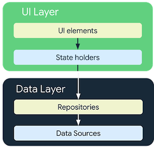
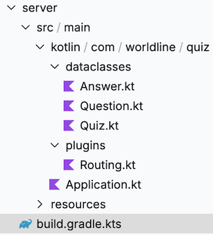

# Connectivity

Let's connect our Quiz app to internet. 

## 📚 Architecture  

:::tip Architecture basics
**Everything You NEED to Know About MVVM Architecture Patterns**
<iframe width="560" height="315" src="https://www.youtube.com/embed/I5c7fBgvkNY" title="Everything You NEED to Know About Client Architecture Patterns" frameborder="0" allow="accelerometer; autoplay; clipboard-write; encrypted-media; gyroscope; picture-in-picture" allowfullscreen></iframe>
:::

### Data layer for KMP

Data layer in KMP is under building but largly inspired by [Android Architecture pattern](https://developer.android.com/topic/architecture/data-layer)



Repository classes are responsible for the following tasks:
  * Exposing data to the rest of the app.
  * Centralizing changes to the data.
  * Resolving conflicts between multiple data sources.
  * Abstracting sources of data from the rest of the app.
  * Containing business logic.

### [Kotlin flow](https://kotlinlang.org/api/kotlinx.coroutines/kotlinx-coroutines-core/kotlinx.coroutines.flow/-flow/)

"A flow is an asynchronous data stream that sequentially emits values and completes normally or with an exception."

There are multiple types of flow, for the Hands-on Lab, we will focus on [`StateFlow`](https://kotlinlang.org/api/kotlinx.coroutines/kotlinx-coroutines-core/kotlinx.coroutines.flow/-state-flow/)

A state flow is a hot flow because its active instance exists independently of the presence of collectors (our composables that consume the data)

### [Coroutine](https://kotlinlang.org/docs/coroutines-basics.html#your-first-coroutine)

"A coroutine is an instance of suspendable computation. It is conceptually similar to a thread, in the sense that it takes a block of code to run that works concurrently with the rest of the code. However, a coroutine is not bound to any particular thread. It may suspend its execution in one thread and resume in another one."


###  🧪 Create your first DataSource and Repository

* Create a mock datasource, that generate a list of question
* Use it with a repository on your QuizScreen

 ### 🎯 Solutions

::: details MockDataSource.kt
``` kotlin 
package network

import network.data.Answer
import network.data.Question

class MockDataSource {

    suspend fun generateDummyQuestionsList():List<Question>{
        return generateQuestionsList()
    }
    fun generateQuestionsList():List<Question>{
        return listOf(
            Question(
                1,
                "Android is a great platform ?",
                1,
                listOf(
                    Answer( 1,"YES"),
                    Answer(2,"NO")
                )
            ),
            Question(
                1,
                "Android is a bad platform ?",
                2,
                listOf(
                    Answer( 1,"YES"),
                    Answer(2,"NO")
                )
            )
        )

    }

}
```
:::

::: details  QuizRepository.kt
``` kotlin
package network

class QuizRepository(sqlDriver: SqlDriver)  {

    private val mockDataSource = MockDataSource()
    private val coroutineScope = CoroutineScope(Dispatchers.Main)
    private var _questionState=  MutableStateFlow(listOf<Question>())
    var questionState = _questionState

    init {
        updateQuiz()
    }

    private fun updateQuiz(){
        coroutineScope.launch {
            _questionState.update {
                    mockDataSource.generateDummyQuestionsList()
            }
        }
    }
}
```
:::

## Connect my Quizz to the internet

For now, we will request a simple plain text json file hosted on this repo that will simulate a REST API call to be able to use our Ktor client.

The request & answers details are specified below :

::: details Request
```bash
POST
content-type: text/plain  
url: https://github.com/worldline/learning-kotlin-multiplatform/raw/main/quiz.json
```
::: 

::: details Answer
```bash
code:200
body: 
{
  "questions": [
    { 
    "id":1, 
    "label":"You can create an emulator to simulate the configuration of a particular type of Android device using a tool like", 
    "correct_answer_id":3, 
    "answers":[
      {"id":1, "label":"Theme Editor"},
      {"id":2, "label":"Android SDK Manager"},
      {"id":3, "label":"AVD Manager"},
      {"id":4, "label":"Virtual Editor"}
     ]
    },
    {
    "id":2, 
    "label":"What parameter specifies the Android API level that Gradle should use to compile your app?", 
    "correct_answer_id":2, 
    "answers":[
      {"id":1, "label":"minSdkVersion"},
      {"id":2, "label":"compileSdkVersion"},
      {"id":3, "label":"targetSdkVersion"},
      {"id":4, "label":"testSdkVersion"}
     ]
    },
  ]
}
```
::: 

To not overcomplexify the app, let's assume that :
  * the QuizAPI provided by Ktor (cf below) is our data source
  * the repository will use a state flow that emit the API answer once at application startup


###  🧪 Ktor as a multiplatform HTTP client

Ktor includes a multiplatform asynchronous HTTP client, which allows you to make requests and handle responses, extend its functionality with plugins, such as authentication and JSON deserialization. 

#### Add global dependencies

Shared sources need it to use ktor library on your code

::: details build.gradle.kts (module : shared) 

``` kotlin
plugins {
...
    kotlin("plugin.serialization") version "1.9.10" 
}
...
val commonMain by getting {
                implementation("io.ktor:ktor-client-core:2.3.4") // core source of ktor
                implementation("org.jetbrains.kotlinx:kotlinx-coroutines-core:1.7.3") // For making asynchronous calls
                implementation("io.ktor:ktor-client-content-negotiation:2.3.4") // Simplify handling of content type based deserialization
                implementation("io.ktor:ktor-serialization-kotlinx-json:2.3.4") // make your dataclasses serializable
  ...
```
::: 

Then on the same file for each platform (android,iOS,desktop), the specific client version needs to be added :

::: details build.gradle.kts (module : shared) 
```kotlin
val androidMain by getting {
            dependencies {
                implementation("io.ktor:ktor-client-android:2.3.4") // for Android
            }
        }
...
val iosMain by creating {
            ...
            dependencies {
                implementation("io.ktor:ktor-client-darwin:2.3.4") //for iOS
            }

        }
...
val desktopMain by getting {
            dependencies {
               ...
                implementation("io.ktor:ktor-client-apache:2.3.4") // for Desktop
            }
        }
```
:::

#### Enable Internet permissions ( Android Only)

You need to enable internet on Android otherwise you will not be able to use ktor client

::: details AndroidManifest.xml(module : androidApp)
```xml
    <uses-permission android:name="android.permission.INTERNET" />
    <uses-permission android:name="android.permission.ACCESS_NETWORK_STATE" />
```
::: 
#### Create the API client in `commonApp`

::: details network.Quiz.kt  (SourceSet : commonMain)
``` kotlin
package network

import io.ktor.client.HttpClient
import io.ktor.client.call.body
import io.ktor.client.plugins.contentnegotiation.ContentNegotiation
import io.ktor.client.request.get
import io.ktor.http.ContentType
import io.ktor.serialization.kotlinx.json.json
import kotlinx.serialization.json.Json
import network.data.Quiz

class QuizAPI {
    private val httpClient = HttpClient {
        install(ContentNegotiation) {
            json(
                contentType = ContentType.Text.Plain, // because Github is not returning an 'application/json' header
                json = Json {
                ignoreUnknownKeys = true
                useAlternativeNames = false
            })
        }
    }
    suspend fun getAllQuestions(): Quiz {
        return httpClient.get("https://awl.li/devoxxkmm2023").body()
    }
}
```
::: 
#### Make all your dataclass become serializable

Ktor need it to transform the json string into your dataclasses

::: details Quiz.kt  (SourceSet : commonMain)
``` kotlin
@kotlinx.serialization.Serializable
data class Quiz(var questions: List<Question>)
```
::: 

::: details Question.kt  (SourceSet : commonMain)
```kotlin
import kotlinx.serialization.SerialInfo
import kotlinx.serialization.SerialName

@kotlinx.serialization.Serializable
data class Question(val id:Int, val label:String, @SerialName("correct_answer_id") val correctAnswerId:Int, val answers:List<Answer>)
```
::: 

::: details Answer.kt  (module : commonMain)
```kotlin
@kotlinx.serialization.Serializable
data class Answer(val id: Int, val label: String )
```
:::

 #### Create your Repository class in `commonApp`

::: details QuizRepository.kt  (module : commonMain)
```kotlin
class QuizRepository()  {

    private val quizAPI = QuizAPI()
    private val coroutineScope = CoroutineScope(Dispatchers.Default)

    private var _questionState=  MutableStateFlow(listOf<Question>())
    var questionState = _questionState

    init {
        updateQuiz()
    }

    private suspend fun fetchQuiz(): List<Question> = quizAPI.getAllQuestions().questions

    private fun updateQuiz(){

        coroutineScope.launch {
            _questionState.update { fetchQuiz() }
        }
    }
}
```
::: 
#### Use the repository in the ViewModel

::: tip 
Domain layer framework such as [`ViewModels`](https://developer.android.com/topic/libraries/architecture/viewmodel) are just available on KMP. But you can also use a third party library such as [`Moko-MVVM`](https://github.com/icerockdev/moko-mvvm) or [`KMM-ViewModel`](https://github.com/rickclephas/KMM-ViewModel) or  [`precompose`]('https://tlaster.github.io/PreCompose/')

:::

Replace mocked data for questions by the repository flow.

::: details App.kt (SourceSet : commonMain)
```kotlin
...
private val repository = QuizRepository()
...

@Composable
internal fun App() {
    MaterialTheme {
        val questions = repository.questionState.collectAsState()

        if(questions.value.isNotEmpty()) {
            questionScreen(questions.value)
        }
    }
}
```
:::

### 🎯 Solutions

::: tip
The full sources can be retrieved [here](https://github.com/worldline/learning-kotlin-multiplatform/raw/main/docs/src/assets/solutions/3.network.zip) 
:::


## Ktor as a rest API server

 ###  🧪 Create a Ktor server module inside your actual project

::: warning
You can create the server module from IntelliJ community or ultimate thanks to a template.
:::

The module tree is as follow 



 ### 🎯 Solutions


  ::: details build.gradle.kts

``` kotlin 
plugins {
    alias(libs.plugins.kotlinJvm)
    alias(libs.plugins.ktor)
    alias(libs.plugins.kotlinSerialization)
    application
}

group = "com.worldline.quiz"
version = "1.0.0"

application {
    mainClass.set("com.worldline.quiz.ApplicationKt")
    applicationDefaultJvmArgs = listOf("-Dio.ktor.development=${extra["io.ktor.development"] ?: "false"}")
}

dependencies {
    implementation(libs.logback)
    implementation(libs.ktor.server.core)
    implementation(libs.ktor.server.cio)
    implementation(libs.ktor.serialization.kotlinx.json)
    implementation(libs.ktor.server.content.negotiation)
    implementation(libs.ktor.server.cors)
    implementation(libs.ktor.server.config.yaml)
}

ktor {
    fatJar {
        archiveFileName.set("fat.jar")
    }
    docker {
        externalRegistry.set(
            io.ktor.plugin.features.DockerImageRegistry.dockerHub(
                appName = provider { "ktor-quiz" },
                username = providers.environmentVariable("KTOR_IMAGE_REGISTRY_USERNAME"),
                password = providers.environmentVariable("KTOR_IMAGE_REGISTRY_PASSWORD")
            )
        )
    }
}
```
:::

 ::: details Application.kt

``` kotlin 
ffun main(args: Array<String>) {
    io.ktor.server.cio.EngineMain.main(args)
}


fun Application.module() {

    install(CORS) {
        allowMethod(HttpMethod.Options)
        allowMethod(HttpMethod.Post)
        allowMethod(HttpMethod.Get)
        allowHeader(HttpHeaders.AccessControlAllowOrigin)
        allowHeader(HttpHeaders.ContentType)
        anyHost()
    }

    install(ContentNegotiation) {
        json()
    }
    configureRouting()
}
```
:::


::: details Routing.kt

```kotlin
fun Application.configureRouting() {

    routing {
        get("/quiz") {
            call.respond(generateQuiz())
        }
        staticResources("/", "static")
    }
}

fun generateQuiz(): Quiz {
    val quizQuestions = mutableListOf<Question>()

    val questions = listOf(
        "What is the primary goal of Kotlin Multiplatform?",
        "How does Kotlin Multiplatform facilitate code sharing between platforms?",
        "Which platforms does Kotlin Multiplatform support?",
        "What is a common use case for Kotlin Multiplatform?",
        "Which naming of KMP is deprecated?",
        "How does Kotlin Multiplatform handle platform-specific implementations?",
        "At which Google I/O, Google announced first-class support for Kotlin on Android?",
        "What is the name of the Kotlin mascot?",
        "The international yearly Kotlin conference is called...",
        "Where will be located the next international yearly Kotlin conference?"
    )

    val answers = listOf(
        listOf(
            "To share code between multiple platforms",
            "To exclusively compile code to JavaScript",
            "To build only Android applications",
            "To create iOS-only applications"
        ),
        listOf(
            "By sharing business logic and adapting UI",
            "By writing separate code for each platform",
            "By using only Java libraries",
            "By using code translation tools"
        ),
        listOf(
            "Android, iOS, desktop and web",
            "Only Android",
            "Only iOS",
            "Only web applications"
        ),
        listOf(
            "Developing a cross-platform app",
            "Building a desktop-only application",
            "Creating a server-side application",
            "Writing a standalone mobile app"
        ),
        listOf(
            "Kotlin Multiplatform Mobile (KMM)",
            "Hadi Multiplatform",
            "Jetpack multiplatform",
            "Kodee multiplatform"
        ),
        listOf(
            "Through expect and actual declarations",
            "By automatically translating code",
            "By restricting to a single platform",
            "By excluding platform-specific features"
        ),
        listOf(
            "2017",
            "2016",
            "2014",
            "2020"
        ),
        listOf(
            "Kodee",
            "Hadee",
            "Kotlinee",
            "Kotee"
        ),
        listOf(
            "KotlinConf",
            "KodeeConf",
            "KConf",
            "KotlinKonf"
        ),
        listOf(
            "Copenhagen, Denmark",
            "Amsterdam, Netherlands",
            "Tokyo, Japan",
            "Lille, France"
        )
    )

    for (i in questions.indices) {
        val shuffledAnswers = answers[i].shuffled(Random.Default)
        val correctAnswerId = shuffledAnswers.indexOfFirst { it == answers[i][0] } + 1
        val question =
            Question(i + 1L, questions[i], correctAnswerId.toLong(), shuffledAnswers.mapIndexed { index, answer ->
                Answer(index + 1L, answer)
            })
        quizQuestions.add(question)
    }

    return Quiz(quizQuestions)
}

```
:::

## Image loading from internet 

To load an image from the internet, you can use the following third-party Compose Multiplatform libraries
- [Compose Image Loader ](https://github.com/qdsfdhvh/compose-imageloader)
- [Kamel](https://github.com/Kamel-Media/Kamel)


::: tip
If you want well-known retrofit style lib, you can use [KtorFit](https://github.com/Foso/Ktorfit) to separate endpoint declaration from httpclient configuration 
:::


An that's it, you quiz have now a remote list of questions.
If you want to get navigation between your WelcomeScreen, QuizScreen and ScoreScreen,
go to the next section →

**✅ If everything is fine, go to the next chapter →**


## 📖 Further reading
- [Ktor client website](https://ktor.io/docs/getting-started-ktor-client.html)
- [Coroutine documentation](https://kotlinlang.org/docs/coroutines-overview.html)
- [Ktor multiplatform documentation](https://kotlinlang.org/docs/multiplatform-mobile-ktor-sqldelight.html)
- [REST API basics](https://www.youtube.com/watch?v=-mN3VyJuCjM&list=WL&index=3)


