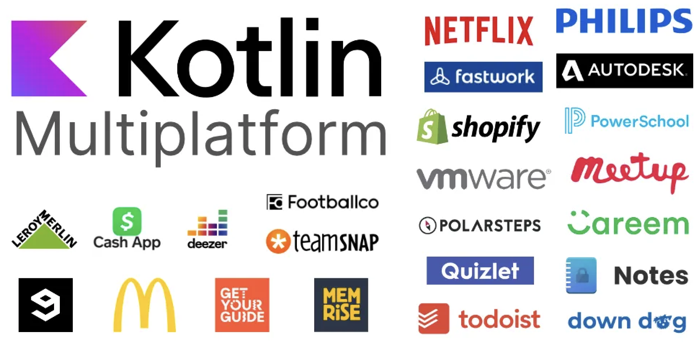
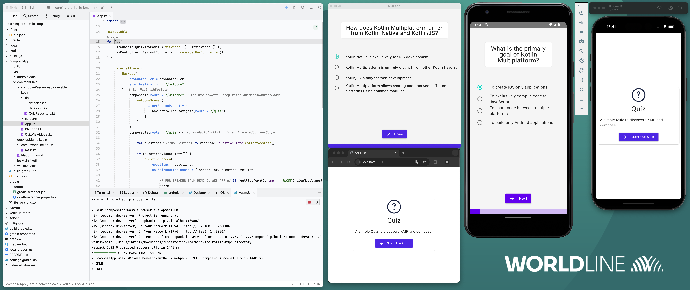
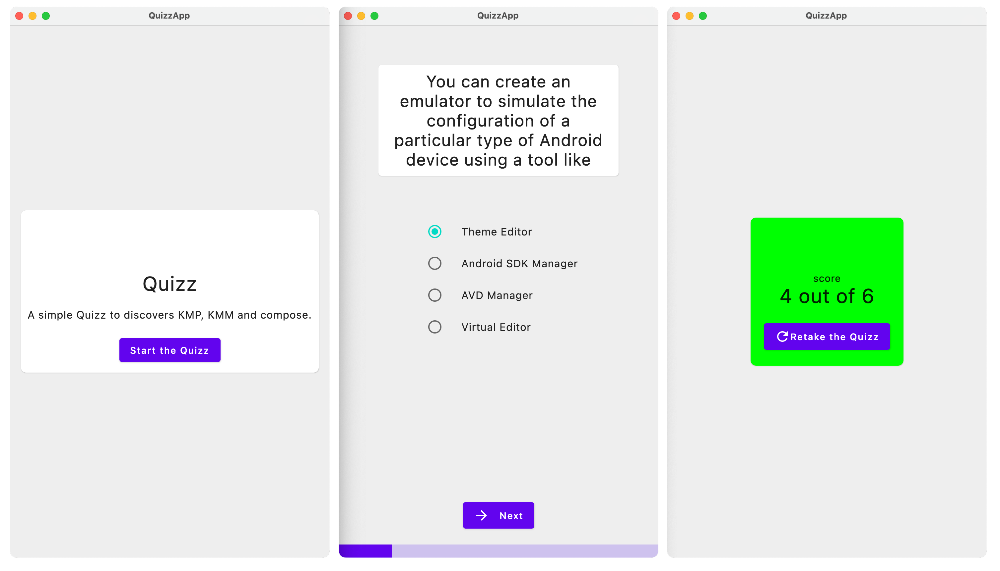

# 🚀 Let's start

## Prerequisites

- Basic knowledge of kotlin development (nullability,inline & lambda functions mainly). For more information, please refer to the [Worldline kotlin training](https://worldline.github.io/learning-kotlin/)
- [Fleet IDE](https://www.jetbrains.com/fleet/) is the dedicated IDE to consider for KMP developpement with exclusive features such as better preview management
- A good connectivity

::: tip Advanced installation
 
For more information about your DEV environment and installs please have a look to jetbrain related [docs](https://kotlinlang.org/docs/multiplatform-mobile-setup.html#next-step)

Consider also installing [Jetbrain ToolBox](https://www.jetbrains.com/toolbox-app/) for managing multiple versions ( Beta , Alpha , stable) of Android Studio or Fleet
:::


### What is Functional Programming?


Definition:
- FP uses an approach to software development that uses pure functions to create maintainable software
- It uses immutable functions and avoids shared states.
- It is in contrast to object-oriented programming languages which uses mutable states
-  It focuses on results and not process, while the iterations like for loops are not allowed

Advantages:
Problems are easy Keeps concurrency safe

 ```swift
 let numbers = [1, 2, 3, 4, 5, 6, 7, 8, 9, 10]

 // Step 1: Filter out even numbers
 let oddNumbers = numbers. filter { $0 % 2 != 0 }

 // Step 2: Square each of the remaining numbers
let squaredNumbers = oddNumbers.map { $0 * $0 }

 // Step 3: Sum up all the squared numbers
let sumOfSquares =squaredNumbers.reduce(0, +)

print("The sum of squares of odd numbers is \(sumOfSquares)")
//output: The sum of squares of odd numbers is 165
```

**Filter**: filters array to include only odd numbers
**Map**: squares the numbers
**Reduce**: sums up the squared numbers

This example demonstrates the core principles of functional programming: using functions as first-class citizens 
to transform and compose data in a clear and concise way.

### Apps using KMP 




* [You can find more case studies here](https://www.jetbrains.com/help/kotlin-multiplatform-dev/case-studies.html)
* [An also samples here](https://www.jetbrains.com/help/kotlin-multiplatform-dev/multiplatform-samples.html)


### KMP roadmap 

[See the roadmap 2024 on official Jetbrain blog](https://blog.jetbrains.com/kotlin/2023/11/kotlin-multiplatform-development-roadmap-for-2024/)


## Hands-on Lab objectives



### Functionnally

We will create a simple quiz application that provides :
- a Startup screen explaining rules of the game
- a Quiz screen looping on single choices questions
- a final scoring screen.

### Technically

- The app can be deployed on Android , iOS and jvm Desktop.
- We will use not only a common library but composable views shared for all platforms


### Design screens

Here are expected screens at the end of this Hands-on Lab.



::: tip Generate composables based on designs
You can generate composables based on designs on Figma thanks to the plugin [Google Relay](https://www.figma.com/community/plugin/1041056822461507786/Relay-for-Figma). A dedicated section on android developer documentation describe all the steps [here](https://developer.android.com/jetpack/compose/tooling/relay?hl=fr)
:::

# See also

- [Github repository for this training](https://github.com/worldline/learning-kotlin-multiplatform)
- [Official Kotlin multiplatform documentation](https://kotlinlang.org/docs/home.html)
- [People in space sample app](https://github.com/joreilly/PeopleInSpace)
- [Compose/Gradle compatibility guide ](https://www.jetbrains.com/help/kotlin-multiplatform-dev/compose-compatibility-and-versioning.html)
- [AGP/ Android studio compatibility guide ](https://developer.android.com/studio/releases?hl=fr#android_gradle_plugin_and_android_studio_compatibility)
- [Compose multiplatform wizard](https://terrakok.github.io/Compose-Multiplatform-Wizard/)
- [Compose multiplatform web wizard](https://terrakok.github.io/kmp-web-wizard/)
- [Figma Now in android](https://www.figma.com/community/file/1164313362327941158/now-in-android-case-study)
- [Kotlin EDUCATION](https://kotlinlang.org/education/)
- [Jetbrain tutorial](https://www.youtube.com/watch?v=5_W5YKPShZ4)
- [CrossPlatform ?](https://ionic.io/resources/articles/ionic-react-vs-react-native)
- [KMP vs Flutter ?](https://developers.googleblog.com/en/making-development-across-platforms-easier-for-developers/)
