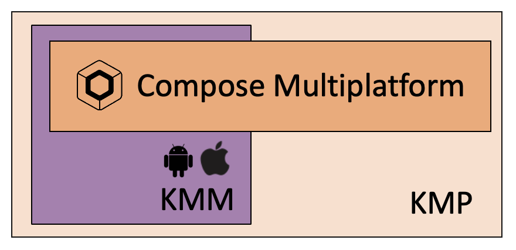

# Let's start (5 min)

## Prerequisites

- Basic knowledge of kotlin development (nullability,inline & lambda functions mainly)
- [Android Studio IDE]('https://developer.android.com/studio') with latest stable version **Electric Eel** version or above 
- A good connectivity

::: tip
For more information about your DEV environment and installs please have a look to jetbrain related [docs]("https://kotlinlang.org/docs/multiplatform-mobile-setup.html#next-step")
:::

## Definitions 

### [Kotlin MultiPlatform (KMP)](https://kotlinlang.org/docs/multiplatform.html)

"The Kotlin Multiplatform technology is designed to simplify the development of cross-platform projects. It reduces time spent writing and maintaining the same code for different platforms while retaining the flexibility and benefits of native programming."

### [Kotlin multiplatform mobile (KMM)](https://kotlinlang.org/docs/multiplatform-mobile-getting-started.html)

"Kotlin Multiplatform Mobile (KMM) is an SDK designed to simplify the development of cross-platform mobile applications. You can share common code between iOS and Android apps and write platform-specific code only where it's necessary. Common use cases for Kotlin Multiplatform Mobile include implementing a native UI or working with platform-specific APIs."

### [Kotlin Compose Multiplatform](https://www.jetbrains.com/lp/compose-mpp/)

"Compose Multiplatform simplifies and accelerates UI development for Desktop and Web applications, and allows extensive UI code sharing between Android, iOS, Desktop and Web."
It's a modern toolkit for building native UI. Quickly bring your app to life with less code, powerful tools, and intuitive Kotlin APIs.
It is based on [Android Jetpack Compose](https://developer.android.com/jetpack/compose) declarative UI approach ( which is similar also to [iOS SwiftUI](https://developer.apple.com/xcode/swiftui/) )

## Codelab objectives

### Functionnally

We will create a simple quiz application that provides :
- a Startup screen explaining rules of the game
- a Quiz screen looping on single choices questions
- a final scoring screen.

### Technically

- The app can be deployed on Android , iOS and jvm Desktop.
- We will use not only a common library but composable views shared for all platforms

### Design screens

Here are expected screens at the end of this codelab.

::: tip
You can generate composables based on designs on Figma thanks to the plugin [Google Relay](https://www.figma.com/community/plugin/1041056822461507786/Relay-for-Figma)
:::

# See also

- [Github repository for this training](https://github.com/worldline/learning-kotlin-multiplatform)
- [Official Kotlin multiplatform documentation](https://kotlinlang.org/docs/home.html)
- [People in space sample app](https://github.com/joreilly/PeopleInSpace)

