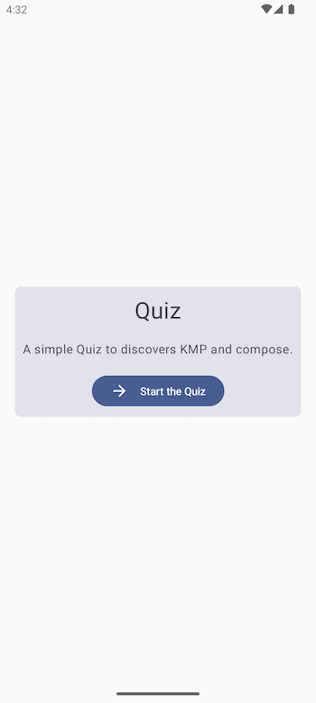
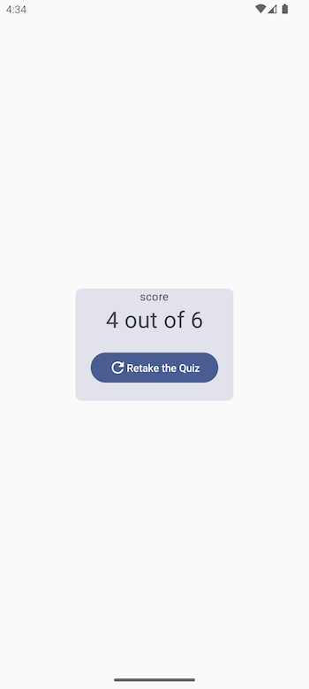

# User interface

## 📚 Reminder 

### [Compose Multiplatform](https://www.jetbrains.com/lp/compose-mpp/)

Compose Multiplatform simplifies and accelerates UI development for Desktop and Web applications, and allows extensive UI code sharing between Android, iOS, Desktop and Web.
It's a modern toolkit for building native UI. Quickly bring your app to life with less code, powerful tools, and intuitive Kotlin APIs.
It is based on [Android Jetpack Compose](https://developer.android.com/jetpack/compose) declarative UI approach ( which is similar also to [SwiftUI](https://developer.apple.com/xcode/swiftui/) for iOS )

### How to create composables ?

Composables are UI components that can be simply declared with code as functions, properties (such as text color, fonts...) as function parameters and subviews are declared on function declaration.

* An `@Composable` annotation come always before the composable function. 
* Properties of size, behaviors of components can be set thanks to `Modifiers`
* You can align components with containers composables such as `Column` (Vertically), `Box`, `Row` (Horizontally)
* Also you can preview composables with the annotation `@Preview` before the composable annotation.

Example: 2 texts vertically aligned that fit all the width of the screen.

```kotlin
@Composable
internal fun App() {
    MaterialTheme {
        Column(Modifier.fillMaxWidth()) {
            Text( "My Text1", color = Color.Blue)
            Text(text = "My Text2")
        }
    }
}
```

::: tip
For more information, you can have a look to [Android Jetpack Compose documentation]('https://developer.android.com/jetpack/compose/layouts/material')
:::

## Create composable for the Quiz


### 🧪 WelcomeScreen



You can now create your first view.
For the Quiz we need a welcome screen displaying a Card centered with a button inside to start the quiz
It is simply compose of the following composables :
* a Card  rounded shape container
* a Text 
* a Button

* Create a new composable `WelcomeScreen.kt` on commonMain module 
* Make sure that the App() composable is using it has below 

```kotlin
@Composable
internal fun App() {
    MaterialTheme {
        welcomeScreen()
    }
}
```

* Run you first view on all platforms , it should work. 

### 🎯 Solutions

::: details WelcomeScreen.kt (SourseSet : commonMain)
```kotlin
import androidx.compose.foundation.layout.Box
import androidx.compose.foundation.layout.Column
import androidx.compose.foundation.layout.fillMaxHeight
import androidx.compose.foundation.layout.fillMaxWidth
import androidx.compose.foundation.layout.padding
import androidx.compose.foundation.shape.RoundedCornerShape
import androidx.compose.material.Button
import androidx.compose.material.Card
import androidx.compose.material.Text
import androidx.compose.runtime.Composable
import androidx.compose.ui.Alignment
import androidx.compose.ui.Modifier
import androidx.compose.ui.unit.dp
import androidx.compose.ui.unit.sp

@Composable()
internal fun welcomeScreen(){

    Box(
        contentAlignment = Alignment.Center,
        modifier = Modifier.fillMaxWidth().fillMaxHeight()
    ) {
        Card(
            shape = RoundedCornerShape(8.dp),
            modifier = Modifier.padding(10.dp),
        ) {
            Column(horizontalAlignment = Alignment.CenterHorizontally) {


                    Column(horizontalAlignment = Alignment.CenterHorizontally) {
                        Text(
                            text = "Quiz",
                            fontSize = 30.sp,
                            modifier = Modifier.padding(all = 10.dp)
                        )
                        Text(
                            modifier = Modifier.padding(all = 10.dp),
                            text = "A simple Quiz to discovers KMP and compose.",
                        )
                        Button(
                            modifier = Modifier.padding(all = 10.dp),
                            onClick = {  }

                        ) {
                            Text("Start the Quiz")
                        }
                    }
            }
        }
    }
}
```
:::

### 🧪 ScoreScreen



The second view will be quite similar but able de show final scores


* Create a new composable `ScoreScreen.kt` on commonMain module 
* Make sure that the App() composable is using it has below 
* The composable will have a `String` value as parameter

```kotlin
@Composable
internal fun App() {
    MaterialTheme {
        scoreScreen("10/20")
    }
}
```

* Run you first view on all platforms , it should work. 

### 🎯 Solutions

::: details ScoreScreen.kt (SourseSet : commonMain)

```kotlin
import androidx.compose.foundation.layout.Box
import androidx.compose.foundation.layout.Column
import androidx.compose.foundation.layout.fillMaxHeight
import androidx.compose.foundation.layout.fillMaxWidth
import androidx.compose.foundation.layout.padding
import androidx.compose.foundation.shape.RoundedCornerShape
import androidx.compose.material.Button
import androidx.compose.material.Card
import androidx.compose.material.Icon
import androidx.compose.material.Text
import androidx.compose.material.icons.Icons
import androidx.compose.material.icons.filled.Refresh
import androidx.compose.runtime.Composable
import androidx.compose.ui.Alignment
import androidx.compose.ui.Modifier
import androidx.compose.ui.graphics.Color
import androidx.compose.ui.unit.dp
import androidx.compose.ui.unit.sp


@Composable()
internal fun scoreScreen(score: String){
    Box(
        contentAlignment = Alignment.Center,
        modifier = Modifier.fillMaxWidth().fillMaxHeight()
    ) {
        Card(
            shape = RoundedCornerShape(8.dp),
            modifier = Modifier.padding(10.dp),
            backgroundColor = Color.Green

        ) {
            Column(horizontalAlignment = Alignment.CenterHorizontally) {


                    Column(horizontalAlignment = Alignment.CenterHorizontally) {

                        Text(
                            fontSize = 15.sp,
                            text = "score",
                        )
                        Text(
                            fontSize = 30.sp,
                            text = score,
                        )
                        Button(
                            modifier = Modifier.padding(all = 20.dp),
                            onClick = {
                            }
                        ) {
                            Icon(Icons.Filled.Refresh, contentDescription = "Localized description")
                            Text(text = "Retake the Quiz",)

                        }
                    }
            }
        }
    }
}
```
:::


### 🧪 QuestionScreen

#### Data classes for Quiz modeling

  

We can create classes on the package `network.data`

::: details Answer.kt (commonMain)
```kotlin
data class Answer(val id: Int, val label: String )
```
:::

::: details Question.kt (commonMain)
```kotlin
data class Question(val id:Int, val label:String, val correctAnswerId:Int, val answers:List<Answer>)
```
:::


::: details Quiz.kt.kt (commonMain)
```kotlin
data class Quiz(var questions: List<Question>)
```
:::

#### Make the composable

Now we can make a composable with interactions.

  

The screen is composed of  : 
* The question label in a `Card`
* Single choice answer component with `RadioButton`
* A `Button` to submit the answer
* A `LinearProgressIndicator` indicating the quiz progress

After creating the UI view, we can pass to this composable the list of questions.
When the `App`composable will create `questionScreen()` composable we will generate mock questions data for now to generate the list of questions.

##### State management

All views of question  will be one unique composable that updates with the correct question/answers data each time we are 
clicking on the `next` button.

We use `MutableState` value for that. It permit to keep data value and recompose the view when the data is changed.
It's exactly what we need for our quiz page :
* Keep the value of the question position on the list 
* Keep the value of the answer selected by the user each time he switch between RadioButtons
* Keep the score to get the final one at the end of the list.

Here is an example of `MutableState` value declaration

```kotlin
    var questionProgress by remember { mutableStateOf(0) }
    ...
```
You can declare the 2 other MutableState values and after use it on your composable ensuring that on the button click `questionProgress`is
incrementing so the question and his answers can change on the view.

### 🎯 Solutions

::: details QuestionScreen.kt (SourceSet : commonMain)
```` kotlin 

import androidx.compose.foundation.layout.Arrangement
import androidx.compose.foundation.layout.Column
import androidx.compose.foundation.layout.Row
import androidx.compose.foundation.layout.fillMaxHeight
import androidx.compose.foundation.layout.fillMaxWidth
import androidx.compose.foundation.layout.height
import androidx.compose.foundation.layout.padding
import androidx.compose.foundation.selection.selectableGroup
import androidx.compose.foundation.shape.RoundedCornerShape
import androidx.compose.material.Button
import androidx.compose.material.Card
import androidx.compose.material.Icon
import androidx.compose.material.LinearProgressIndicator
import androidx.compose.material.RadioButton
import androidx.compose.material.Text
import androidx.compose.material.icons.Icons
import androidx.compose.material.icons.filled.ArrowForward
import androidx.compose.material.icons.filled.Done
import androidx.compose.runtime.Composable
import androidx.compose.runtime.getValue
import androidx.compose.runtime.mutableStateOf
import androidx.compose.runtime.remember
import androidx.compose.runtime.setValue
import androidx.compose.ui.Alignment
import androidx.compose.ui.Modifier
import androidx.compose.ui.graphics.vector.ImageVector
import androidx.compose.ui.text.style.TextAlign
import androidx.compose.ui.unit.dp
import androidx.compose.ui.unit.sp
import network.data.Question

@Composable()
internal fun questionScreen(questions: List<Question>) {

    var questionProgress by remember { mutableStateOf(0) }
    var selectedAnswer by remember { mutableStateOf(1) }
    var score by remember { mutableStateOf(0) }

    Column(
        modifier = Modifier.fillMaxWidth().fillMaxHeight(),
        verticalArrangement = Arrangement.Center,
        horizontalAlignment = Alignment.CenterHorizontally
    ) {
        Card(
            shape = RoundedCornerShape(5.dp),
            modifier = Modifier.padding(60.dp)
        ) {
            Column(
                horizontalAlignment = Alignment.CenterHorizontally,
                modifier = Modifier.padding(horizontal = 10.dp)
            ) {
                Text(
                    modifier = Modifier.padding(all = 10.dp),
                    text = questions[questionProgress].label,
                    fontSize = 25.sp,
                    textAlign = TextAlign.Center
                )
            }
        }
        Column(modifier = Modifier.selectableGroup()) {
            questions[questionProgress].answers.forEach { answer ->
                Row(
                    modifier = Modifier.padding(horizontal = 16.dp),
                    verticalAlignment = Alignment.CenterVertically
                ) {
                    RadioButton(
                        modifier = Modifier.padding(end = 16.dp),
                        selected = (selectedAnswer == answer.id),
                        onClick = { selectedAnswer = answer.id },
                    )
                    Text(text = answer.label)
                }
            }
        }
        Column(modifier = Modifier.fillMaxHeight(), horizontalAlignment = Alignment.CenterHorizontally, verticalArrangement = Arrangement.Bottom) {
            Button(
                modifier = Modifier.padding(bottom = 20.dp),
                onClick = {
                    if(selectedAnswer == questions[questionProgress].correctAnswerId) {
                        score++
                    }
                    if (questionProgress < questions.size - 1) {
                        questionProgress++
                        selectedAnswer = 1
                    }else{
                        // Go to the score section
                    }
                }
            ) {
                if(questionProgress < questions.size - 1) nextOrDoneButton(Icons.Filled.ArrowForward,"Next")
                else nextOrDoneButton(Icons.Filled.Done,"Done")
            }
            LinearProgressIndicator(modifier = Modifier.fillMaxWidth().height(20.dp), progress = questionProgress.div(questions.size.toFloat()).plus(1.div(questions.size.toFloat())))
        }
    }
}

@Composable
internal fun nextOrDoneButton(iv: ImageVector, label:String){
    Icon(
        iv,
        contentDescription = "Localized description",
        Modifier.padding(end = 15.dp)
    )
    Text(label)
}
````
:::

::: details App.kt (SourceSet : commonMain)
```` kotlin 
@Composable
internal fun App() {
    MaterialTheme {
        var questions = listOf(
            Question(
                1,
                "Android is a great platform ?",
                1,
                listOf(Answer(1, "YES"), Answer(2, "NO"))
            ),
            Question(
                1,
                "Android is a bad platform ?",
                2,
                listOf(Answer(1, "YES"), Answer(2, "NO"))
            )
        )
        questionScreen(questions)
    }
}
````
:::

Your Quiz have now all his composable screens made. Let's connect it to the Internet

**✅ If everything is fine, go to the next chapter →**

::: tip
The full solution for this section is availabe [here](https://github.com/worldline/learning-kotlin-multiplatform/raw/main/docs/src/assets/solutions/2.ui.zip) 
:::


## 📖 Further reading
- [Jetpack Compose for iOS](https://betterprogramming.pub/jetpack-compose-for-ios-getting-started-step-by-step-e7be6f52edd4)
- [Android Jetpack Compose documentation]('https://developer.android.com/jetpack/compose/layouts/material')
- [Android Jetpack Compose](https://developer.android.com/jetpack/compose) 
- [Kotlin Compose Multiplatform](https://www.jetbrains.com/lp/compose-mpp/)
- [SwiftUI](https://developer.apple.com/xcode/swiftui/)
- [Composables snippets](https://www.jetpackcompose.app/snippets)
- [Composables widget database](https://www.composables.com/)
- [Compare declarative UI](https://www.jetpackcompose.app/compare-declarative-frameworks/JetpackCompose-vs-SwiftUI-vs-Flutter)
- [KMP samples list](https://www.jetbrains.com/help/kotlin-multiplatform-dev/multiplatform-samples.html)
- [Jetpack compose composables](https://developer.android.com/jetpack/compose/components)
